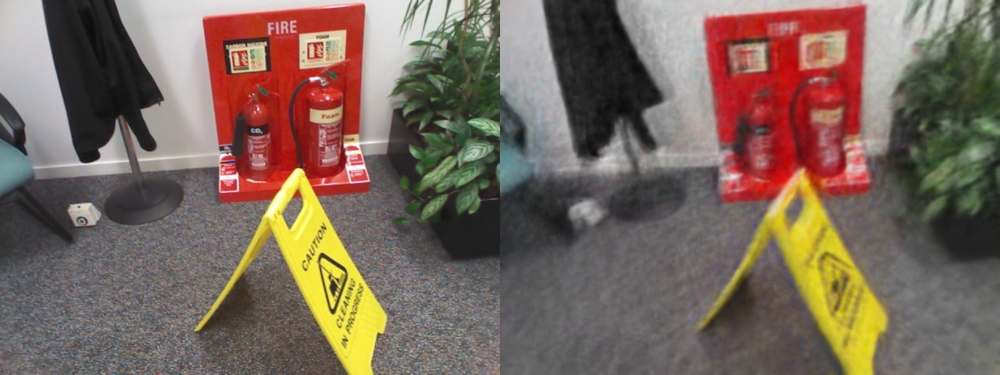
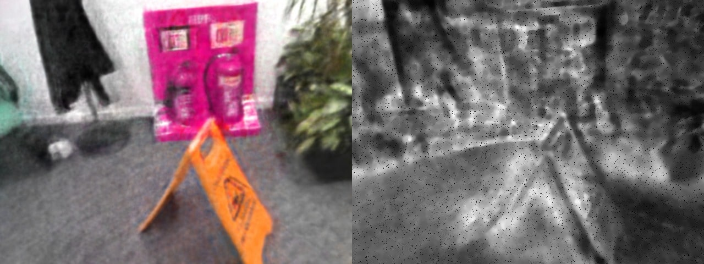

<div align="center">

  <h1>NeRF-Augmented Training of Vision Transformers (ViTs) 🎓</h1>

  <p>
    <em>Babeș-Bolyai University of Cluj-Napoca</em><br>
    Author: <strong>Denis-Vasile Pop</strong><br>
    Supervisor: <strong>Prof. Dr. Sergiu-Adrian Darabant</strong><br>
    Year: <strong>2025</strong>
  </p>

</div>


## 🧠 Abstract

This project explores the use of **Neural Radiance Fields (NeRF)** for generating synthetic **RGB-D data** to improve the fine-tuning of **Vision Transformers (ViTs)** in computer vision tasks.  
Two model families were analyzed:
- **Tiny RoMa** – dense stereo feature matching (CNN)  
- **Depth-Anything-V2** – monocular depth estimation (ViT)  

Synthetic data was produced with **Instant-NGP** and integrated into the **7-Scenes** and **NeRF-Stereo** datasets.  
To support the experiments, I also created and released a custom dataset:  
👉 **[NeRF-Augmented 7-Scenes](https://huggingface.co/datasets/denis-vp/nerf-augmented-7-scenes)** — a hybrid real/synthetic dataset combining Microsoft’s 7-Scenes with NeRF-generated frames, available on Hugging Face.

The study evaluates how NeRF-based augmentation influences the training of Transformer-based vision models, focusing on accuracy, generalization, and stability across real and synthetic domains.


## 📊 Results Summary

| Model | Task | Dataset | NeRF Impact |
|--------|------|----------|--------------|
| **Tiny RoMa** | Stereo feature matching | 7-Scenes Fire (15% synthetic) | ✅ Slight improvement in coarse matches |
| **Tiny RoMa** | Stereo feature matching | NeRF-Stereo (100% synthetic) | ❌ Poor generalization |
| **Depth-Anything-V2 (ViT-B)** | Monocular depth estimation | 7-Scenes Fire | ❌ 25% performance drop with synthetic data |
| **Depth-Anything-V2 (ViT-L)** | Monocular depth estimation | NeRF-Stereo 0097 | ❌ Training instability, overfitting |

**Conclusion:**  
NeRF-generated data can modestly improve Transformer-based stereo matching, but degrades monocular depth performance when used directly. Synthetic data should be balanced and used with caution.


## 🧪 Examples

The following examples illustrate the **data generation and augmentation process** used in this project. Each NeRF model was trained on small subsets of the **7-Scenes** dataset (e.g., *Fire* scene) to reconstruct and render synthetic RGB-D frames, which were later integrated into the training data for Transformer-based models.

---

<div align="center"><strong>Original vs NeRF Render</strong></div>

  

<div align="center"><strong>Post-processed NeRF Output</strong></div>

  

---

## 💡 Highlights

- Generated partially synthetic and fully synthetic RGB-D datasets  
- Quantitatively compared NeRF-augmented vs. real-only training  
- Built a full-stack demo app for interactive model testing  


## 🧩 Tech Stack

- **NeRF Training:** [nerf-template (Instant-NGP)](https://github.com/ashawkey/nerf-template)  
- **Models:** Tiny RoMa, Depth-Anything-V2 (DINOv2-based)  
- **Frameworks:** PyTorch, FastAPI, React, Gradio  

In addition to the experiments, I built a **full-stack web application** that allows users to interactively test the fine-tuned models. The **FastAPI backend** serves inference endpoints for both models, while a **React frontend** provides an intuitive interface for uploading images and visualizing predicted depth maps or feature matches. A lightweight **Gradio interface** is also included for quick prototyping and experimentation.  


## 📘 Citation

```
@thesis{den2025nerfvit,
  author      = {Denis-Vasile Pop},
  title       = {NeRF-Augmented Training of Vision Transformers (ViTs)},
  school      = {Babes-Bolyai University},
  type        = {Bachelor's Thesis},
  year        = {2025},
  address     = {Cluj-Napoca, Romania},
  url         = {}
}

@inproceedings{shotton2013scene,
    title     = {Scene coordinate regression forests for camera relocalization in RGB-D images},
    author    = {Shotton, Jamie and Glocker, Ben and Zach, Christopher and Izadi, Shahram and Criminisi, Antonio and Fitzgibbon, Andrew},
    booktitle = {Proceedings of the IEEE conference on computer vision and pattern recognition},
    year      = {2013}
}

@inproceedings{Tosi_2023_CVPR,
    author    = {Tosi, Fabio and Tonioni, Alessio and De Gregorio, Daniele and Poggi, Matteo},
    title     = {NeRF-Supervised Deep Stereo},
    booktitle = {Conference on Computer Vision and Pattern Recognition (CVPR)},
    month     = {June},
    year      = {2023},
    pages     = {855-866}
}
```

## 📜 License

This project is licensed under the MIT License — see the `LICENSE` file for details.

If you redistribute or modify the project, please retain the above copyright notice and
license terms as required by the MIT license.

---

<div align="center">

⭐ **Exploring synthetic vision data — one NeRF at a time.** ⭐

</div>