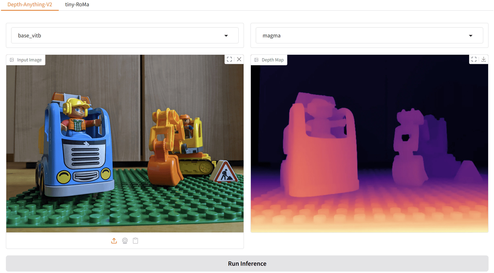
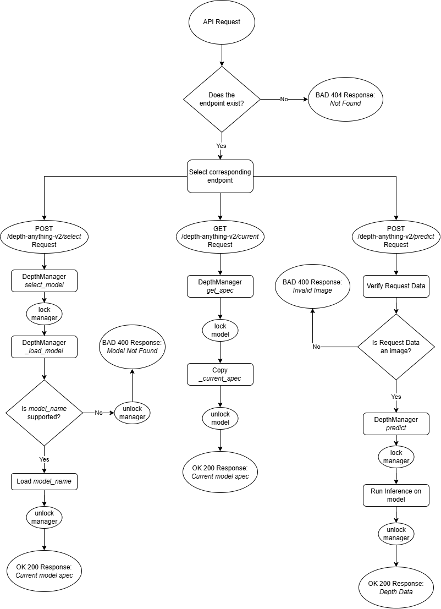

# NeRF Demo Application

This is a demo application for depth estimation and feature matching using state-of-the-art models, including Depth-Anything-V2 and Tiny RoMa. The application features a Gradio-based web UI and FastAPI backend for easy experimentation and visualization.

## Features

- **Depth Estimation**: Run monocular depth estimation using multiple model checkpoints.
- **Feature Matching**: Perform feature matching between image pairs using Tiny RoMa models.
- **Interactive UI**: Gradio web interface for running inference and visualizing results.
- **REST API**: FastAPI endpoints for programmatic access to model inference.

## Project Structure

```
src/
  config.py                # Model and checkpoint configuration
  gradio_app/              # Gradio UI components
    app.py                 # Main Gradio app entrypoint
    depth_ui.py            # Depth estimation UI
    roma_ui.py             # Feature matching UI
  model_mangers/           # Model manager classes
    depth_manager.py
    roma_manager.py
    model_manager.py
  routes/                  # FastAPI route definitions
    depth_route.py
    roma_route.py
  third_party/             # Third-party model code (Depth-Anything-V2, RoMa)
  utils/                   # Visualization utilities
tests/                     # Unit and integration tests
checkpoints/               # Model checkpoint files
requirements.txt           # Python dependencies
setup.py                   # Python package setup
```

## Installation

1. **Install dependencies**  
   It is recommended to use a virtual environment.
   ```sh
   python -m venv venv
   source venv/bin/activate  # On Windows: venv\Scripts\activate
   pip install -r requirements.txt
   ```

2. **Download Model Checkpoints**  
   Place the required model checkpoints in the `checkpoints/` directory as specified in [`src/config.py`](src/config.py).

3. **(Optional) Install as a Package**  
   If you want to install the application as a Python package (for easier imports or deployment), you can use the provided `setup.py`:
   ```sh
   pip install .
   ```
   This will install the package defined in `setup.py` and its dependencies.

## Usage

### Gradio UI

To launch the Gradio demo interface:
```sh
python -m src.gradio_app.app
```
This will start a local web server where you can interact with the models.

#### Gradio Preview

You can interactively test the models using the Gradio web UI.  
After starting the Gradio app, you’ll see a preview like this:



### FastAPI Backend

You can run the FastAPI backend for programmatic access:
```sh
uvicorn main:app --reload
```
This will start one server with both routers available under the same API.

### Running Tests

To run the test suite:
```sh
pytest
```

## depth-anything-v2 Route Flow Diagram

Below is a flow diagram illustrating how requests are handled by the depth-anything-v2 FastAPI routes:



## Configuration

Model paths and available checkpoints are configured in [`src/config.py`](src/config.py).  
Update this file if you add new models or checkpoints.
