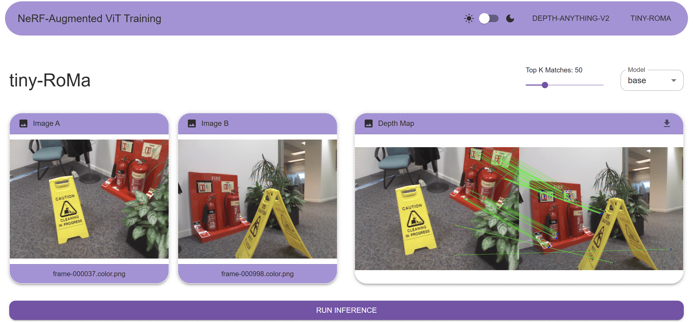

# NeRF-Augmented ViT Training Frontend

This is the frontend React application for the NeRF-Augmented ViT Training project. It provides a user interface for running and visualizing depth estimation and feature matching using state-of-the-art models.

## Features

- **Depth-Anything-V2**: Upload an image and run depth estimation using selectable models and colormaps.
- **Tiny RoMa**: Upload two images and visualize feature matches between them using selectable models and top-K filtering.
- **Light/Dark Theme**: Toggle between light and dark modes.
- **Download Results**: Download output images directly from the interface.

## UI Preview — Tiny RoMa Tab

Below is a preview of the Tiny RoMa tab:



## Project Structure

```
src/
  api/                # API clients and types
  components/         # Reusable UI components
  pages/              # Main application pages
  utils/              # Visualization and helper utilities
  theme.ts            # Theme configuration
  App.tsx             # Main app component
  main.tsx            # Entry point
  index.css           # Global styles
```

## Getting Started

### Prerequisites

- [Node.js](https://nodejs.org/) (v18 or newer recommended)
- [npm](https://www.npmjs.com/) or [yarn](https://yarnpkg.com/)

### Installation

1. Install dependencies:

   ```sh
   npm install
   # or
   yarn install
   ```

2. Create a `.env` file in the `frontend` directory and set the API base URL:

   ```
   VITE_API_BASE_URL=http://localhost:8000
   ```

### Running the App

Start the development server:

```sh
npm run dev
# or
yarn dev
```

The app will be available at [http://localhost:5173](http://localhost:5173) by default.

### Running Tests

To run unit tests:

```sh
npm run test
# or
yarn test
```

## Usage

- **Depth-Anything-V2**:  
  - Upload an image.
  - Select a depth model and colormap.
  - Click "Run Inference" to generate and view the depth map.

- **Tiny RoMa**:  
  - Upload two images.
  - Select a matching model and adjust the top-K slider.
  - Click "Run Inference" to visualize feature matches.

## Technologies Used

- [React](https://react.dev/)
- [Vite](https://vitejs.dev/)
- [Material UI](https://mui.com/)
- [Vitest](https://vitest.dev/) & [Testing Library](https://testing-library.com/)
- [TypeScript](https://www.typescriptlang.org/)
- [Axios](https://axios-http.com/)
- [React Router](https://reactrouter.com/)
